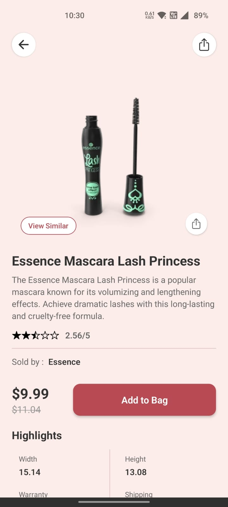

# 🛍️ Viorra - Mobile E-commerce App

A modern, responsive mobile e-commerce application built with React Native and Expo, featuring a beautiful UI design and seamless shopping experience.

## 📱 App Screenshots

### Onboarding Screen


### Login Screen


### Registration Screen


### Home Screen


### Product Details Part 1


### Product Details Part 2


### Profile Screen


## 🎥 Demo Video

📹 **[Watch Demo Video](https://www.youtube.com/shorts/fUZwQO5A_BM)** *(Replace with your actual demo video link)*

## ✨ Features

### 🎨 **Beautiful UI/UX**
- Modern, minimalist design with custom fonts
- Smooth animations and transitions
- Responsive layout for all screen sizes
- Custom color scheme (#FCEDEA, #B84953)

### 🔍 **Advanced Search & Filtering**
- Real-time search with debouncing (500ms)
- Search across product title, description, and category
- Comprehensive filter system:
  - Category selection (Smartphones, Laptops, Beauty, Furniture)
  - Price range filtering (Min/Max)
  - Sort options (Name, Price, Rating)
  - Sort order (Low to High, High to Low)

### 📱 **Product Management**
- Dynamic product grid with pagination
- Infinite scrolling (10 products per page)
- Product cards with images, prices, and categories
- Like/unlike functionality for products
- Product detail pages with full information


### 📊 **API Integration**
- **DummyJSON API** fully integrated for dynamic content
- Real-time product data fetching
- Search API integration (`/products/search?q=`)
- Category-based filtering
- Pagination support with `limit` and `skip` parameters

## 🛠️ Tech Stack

- **Frontend**: React Native + Expo
- **Navigation**: Expo Router
- **State Management**: React Hooks (useState, useEffect, useCallback, useMemo)
- **API**: DummyJSON REST API
- **Icons**: Expo Vector Icons (Ionicons)
- **Fonts**: Custom TTF fonts (Inter Light, Playfair Display ExtraBold)
- **Styling**: StyleSheet with responsive design
- **Build Tool**: Expo CLI + Gradle

## 📋 Prerequisites

Before you begin, ensure you have the following installed:
- [Node.js](https://nodejs.org/) (v16 or higher)
- [npm](https://www.npmjs.com/) or [yarn](https://yarnpkg.com/)
- [Expo CLI](https://docs.expo.dev/get-started/installation/)
- [Android Studio](https://developer.android.com/studio) (for Android builds)
- [Android SDK](https://developer.android.com/studio#command-tools)
- [Java Development Kit (JDK)](https://adoptium.net/) (v11 or higher)

## 🚀 Setup Instructions

### 1. **Clone the Repository**
```bash
git clone <your-repository-url>
cd viorra
```

### 2. **Install Dependencies**
```bash
npm install
# or
yarn install
```

### 3. **Install Expo CLI Globally**
```bash
npm install -g @expo/cli
```

### 4. **Start Development Server**
```bash
npx expo start
```

### 5. **Run on Device/Emulator**

#### **Option A: Expo Go (Development)**
1. Install [Expo Go](https://expo.dev/client) on your device
2. Scan the QR code from the terminal
3. App will load in Expo Go

#### **Option B: Development Build (Recommended)**
```bash
npx expo run:android
# or
npx expo run:ios
```

## 🏗️ Building Standalone APK

### **First Time Setup (Generate Native Project)**
```bash
npx expo prebuild --platform android
```

### **Build Release APK**
```bash
cd android
./gradlew assembleRelease
```

The APK will be generated at:
```
android/app/build/outputs/apk/release/app-release.apk
```

### **Subsequent Builds (No Native Changes)**
```bash
cd android
./gradlew assembleRelease
```

### **When to Re-run Prebuild**
Only run `npx expo prebuild --platform android` when:
- Installing/updating native libraries
- Changing app.json configuration
- Upgrading Expo SDK version
- Adding new native dependencies

## 🔌 API Integration Details

### **DummyJSON API Endpoints Used**
- **Products**: `https://dummyjson.com/products`
- **Search**: `https://dummyjson.com/products/search?q={query}`
- **Categories**: `https://dummyjson.com/products/categories`
- **Single Product**: `https://dummyjson.com/products/{id}`

### **API Features**
- **Pagination**: `limit=10&skip={page}`
- **Search**: Real-time search across multiple fields
- **Filtering**: Category-based and price range filtering
- **Sorting**: By name, price, or rating
- **Dynamic Content**: All product data fetched from API

## 📁 Project Structure

```
viorra/
├── app/                    # Expo Router app directory
│   ├── (app)/             # Main app screens
│   │   ├── (tabs)/        # Tab navigation
│   │   │   ├── home.tsx   # Home screen with products
│   │   │   └── profile.tsx # User profile screen
│   │   ├── onboarding.tsx # Onboarding screen
│   │   ├── login.tsx      # Login screen
│   │   ├── register.tsx   # Registration screen
│   │   └── product/       # Product detail screens
│   │       └── [id].tsx   # Dynamic product page
│   └── _layout.tsx        # Root layout with font loading
├── assets/                 # Static assets
│   ├── fonts/             # Custom font files
│   │   ├── Inter-Light.ttf
│   │   └── PlayfairDisplay-ExtraBold.ttf
│   └── images/            # App images and icons
├── components/             # Reusable components
│   ├── ItalianaText.tsx   # Custom text component
│   ├── InterText.tsx      # Inter font component
│   └── PlayfairText.tsx   # Playfair font component
├── constants/              # App constants
├── hooks/                  # Custom React hooks
└── scripts/                # Build and utility scripts
```

## 🎨 Custom Components

### **Font Components**
- **`ItalianaText`**: Italiana font for brand elements
- **`InterText`**: Inter Light font for body text
- **`PlayfairText`**: Playfair Display ExtraBold for headings

### **UI Components**
- **Product Cards**: Responsive grid layout with images and details
- **Search Bar**: Debounced search with clear functionality
- **Filter Modal**: Comprehensive filtering system
- **Loading States**: Optimized loading indicators

## 🔧 Configuration

### **app.json Key Settings**
```json
{
  "expo": {
    "name": "Viorra",
    "slug": "viorra",
    "version": "1.0.0",
    "orientation": "portrait",
    "icon": "./assets/images/icon.png",
    "splash": {
      "image": "./assets/images/splash.png",
      "backgroundColor": "#E8B4B8"
    },
    "android": {
      "package": "com.anonymous.viorra",
      "adaptiveIcon": {
        "foregroundImage": "./assets/images/icon.png",
        "backgroundColor": "#ffffff"
      }
    }
  }
}
```

## 🚀 Performance Features

- **Infinite Scrolling**: Efficient pagination with FlatList
- **Image Optimization**: Optimized product images
- **Debounced Search**: 500ms delay for better performance
- **Lazy Loading**: Components load only when needed
- **Memory Management**: Proper cleanup of timeouts and listeners

## 🐛 Troubleshooting

### **Common Issues**

#### **Build Failures**
```bash
# Clean build directory
rm -rf android
npx expo prebuild --platform android --clean
```

#### **Font Loading Issues**
```bash
# Ensure fonts are in assets/fonts/
# Check font names in _layout.tsx
```

#### **API Connection Issues**
- Verify internet connection
- Check DummyJSON API status
- Ensure proper error handling in fetch calls

#### **Development Server Issues**
```bash
# Clear Metro cache
npx expo start --clear

# Reset Expo cache
npx expo install --fix
```

## 📱 Supported Platforms

- ✅ **Android**: 6.0 (API level 23) and higher
- ✅ **iOS**: 12.0 and higher
- ✅ **Web**: Responsive web version (optional)

## 🤝 Contributing

1. Fork the repository
2. Create a feature branch (`git checkout -b feature/AmazingFeature`)
3. Commit your changes (`git commit -m 'Add some AmazingFeature'`)
4. Push to the branch (`git push origin feature/AmazingFeature`)
5. Open a Pull Request

## 📄 License

This project is licensed under the MIT License - see the [LICENSE](LICENSE) file for details.

## 🙏 Acknowledgments

- **DummyJSON** for providing the product API
- **Expo** team for the amazing development platform
- **React Native** community for continuous improvements
- **Google Fonts** for the beautiful typography

## 📞 Support

If you encounter any issues or have questions:

- **GitHub Issues**: [Create an issue](https://github.com/yourusername/viorra/issues)
- **Email**: your.email@example.com
- **Documentation**: [Expo Docs](https://docs.expo.dev/)

---

**Made with ❤️ using React Native & Expo**

*Last updated: August 2024*